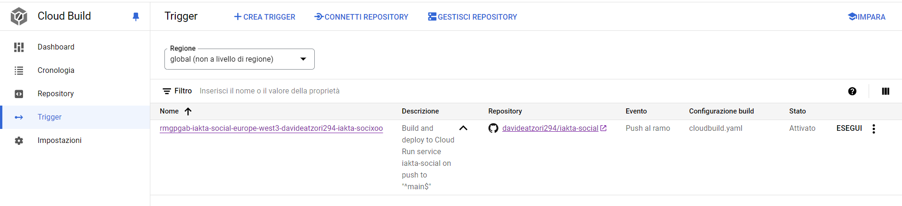
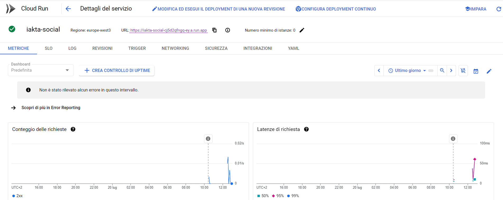
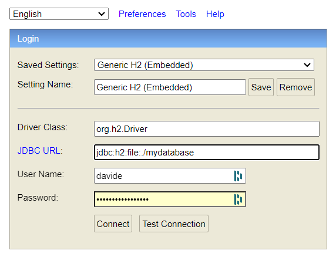

# A simple API server

  

## General Description

The solution consists of a Java Spring Boot app and an embedded H2 database that acts as a MySQL instance. 
Authentication is handled via JWT.  The app is serverlessly deployed on Google Cloud Run at:
 - [https://iakta-social-cj5d2qfngq-ey.a.run.app](https://iakta-social-cj5d2qfngq-ey.a.run.app)
  

  

You can access the H2 database console at the URL:
 

 - [https://iakta-social-cj5d2qfngq-ey.a.run.app/h2-console](https://iakta-social-cj5d2qfngq-ey.a.run.app/h2-console)
 - **JDBC URL**: *jdbc:h2:file:./mydatabase*
 - **User Name**: *davide*
 - **Password**: *T4ScE3L5Tf58srdRp*
  

  A [.jar file](https://github.com/davideatzori294/iakta-social/releases/tag/v0.0.1) containing the application is present under the <i>Releases</i> tab of this repo for local testing.   
Postman collections are present under the folder <i>/postman</i>   
You can also find a Swagger UI at the following url: 

-  [https://iakta-social-cj5d2qfngq-ey.a.run.app/swagger-ui/index.html](https://iakta-social-cj5d2qfngq-ey.a.run.app/swagger-ui/index.html)
