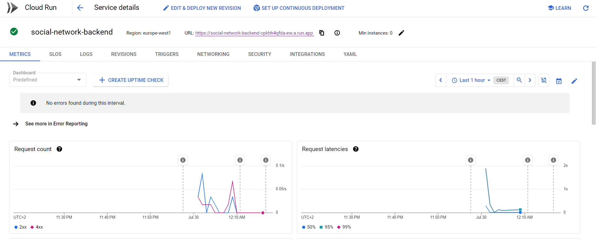

# Simple Social platform exercise

  

#### General Description

This is a Java Spring Boot app utilizing an embedded H2 Database that simulates a MySQL instance.  The app is serverlessly deployed on Google Cloud Run at:
 - [https://iakta-social-cj5d2qfngq-ey.a.run.app](https://iakta-social-cj5d2qfngq-ey.a.run.app)
  

  

The H2 database console can be access at the url:
 

 - [https://iakta-social-cj5d2qfngq-ey.a.run.app/h2-console](https://iakta-social-cj5d2qfngq-ey.a.run.app/h2-console)
 - **JDBC URL**: *jdbc:h2:file:./mydatabase*
 - **User Name**: *davide*
 - **Password**: *T4ScE3L5Tf58srdRp*
 

  A jar file containing the application for local testing is present under the *Releases* tab of this repo.   
A postman collection is present under the folder /postman   
A Swagger UI is also present at the url: 

-  [https://iakta-social-cj5d2qfngq-ey.a.run.app/swagger-ui/index.html](https://iakta-social-cj5d2qfngq-ey.a.run.app/swagger-ui/index.html)
