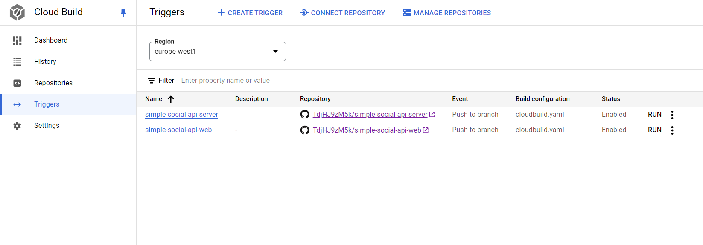

# Simple Social Network API Server

## General Description

This is a week-long project for a Simple Social Network API Server. The features are authentication, user following, posting, and commenting functionalities.

- **Technology Stack**: Java Spring Boot
- **Database**: Embedded H2 (acting as a MySQL instance)
- **Authentication**: JWT
- **Deployment**: Serverless, with Continuous Deployment pipeline on Google Cloud Run

You can access the live deployment at:
[https://iakta-social-cj5d2qfngq-ew.a.run.app](https://iakta-social-cj5d2qfngq-ew.a.run.app)

## Screenshots

### Cloud Build Trigger

### Deployment on Cloud Run

## H2 Database Console

You can access the H2 database console at:
[https://iakta-social-cj5d2qfngq-ew.a.run.app/h2-console](https://iakta-social-cj5d2qfngq-ew.a.run.app/h2-console)

- **JDBC URL**: `jdbc:h2:file:./mydatabase`
- **User Name**: `davide`
- **Password**: `T4ScE3L5Tf58srdRp`

## Local Testing

A [`.jar file`](https://github.com/davideatzori294/iakta-social/releases/tag/v0.0.2) containing the application is available under the Releases tab of this repository for local testing.

## Postman Collections

You can find the Postman collections in the [postman](https://github.com/davideatzori294/iakta-social/tree/main/postman) folder.

## Swagger UI

Explore the API with Swagger UI at:
[https://iakta-social-cj5d2qfngq-ew.a.run.app/swagger-ui/index.html](https://iakta-social-cj5d2qfngq-ew.a.run.app/swagger-ui/index.html)
